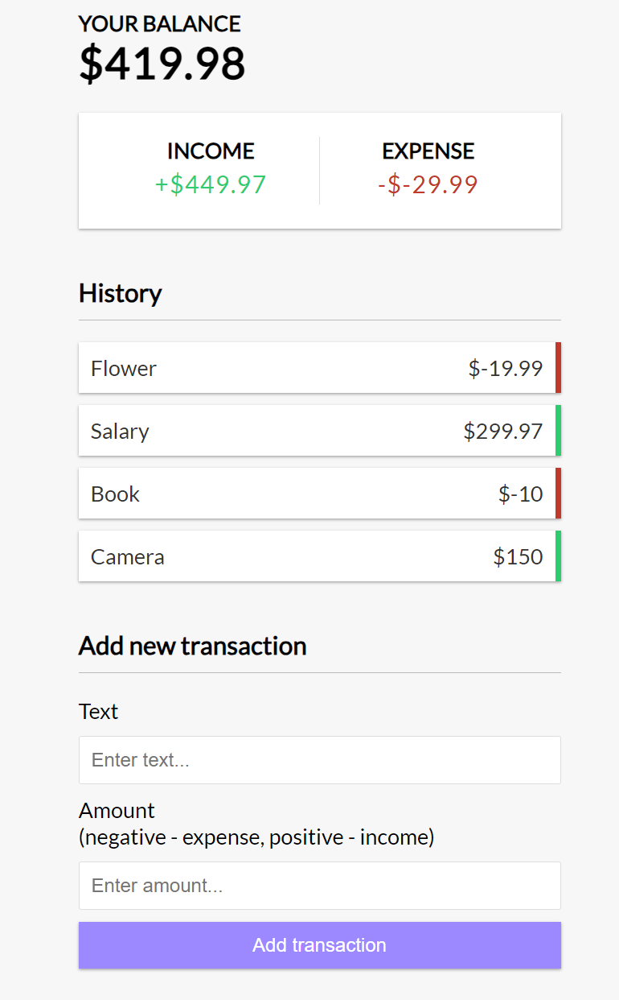

## Vue 3 Expense Tracker
> made with Vue3 and the composition API
> nodejs version: 20
> npm version:    10
> Special credits to: Brad / Traversy Media
> YouTube video:  https://www.youtube.com/watch?v=hNPwdOZ3qFU

- Usage:
    - copy the `.devcontainer` folder into your project
    - in `VsCode`, click on `Reopen in Devcontainer`.